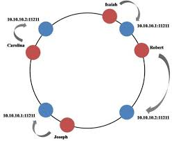

# System Design by Gaurav sen 

## Important concepts
- optimize processes and increase throughputs using the same resource
- Preparing before-hand at non-peak hours. Pre-processing
- Create backups and avoid single point failures
- hire more resources (Horizontal scaling)
- Master slave architectures (creating backups)
- Distributed systems
- Load Balancers
- Decoupling
- Logging and metrics
- Make your system extensible. Decoupled modules.

## Horizontal vs Vertical Scaling

Horizontal Scaling - 
- load balancer required
- resilient *
- network calls used (RPC) (slower)
- Data consistency issues
- scales well with increase in users *

Vertical Scaling - 
- no load balancing required
- single point of failure
- inter-process communication (faster) *
- consistent *
- Hardware limitations

best option - use a hybrid of both the solutions taking the best features(*) from both the models. 

## Load Balancing 

Lets assume we have N servers for running an application. If we have to balance the load we can have the following approach - 
- generate the request Id (rid) and send it to the server. 
- find sno = H(rid)%N, and send the request to the server with sno

sometimes the request id is not at random, and follows some structure. for example it can be the user id of a user. That means all the request from the user will go to the same server. 
In that case we can have some cache stored to make the response faster. 

Now if the number of servers increase, the new way to balance becomes - 
find sno_new = H(rid)%(N+1), and send to the respective server. 

This will result in changing the request location, thus making all the cache stored useless. 

Therefore the problem is not load balancing, but adding and removing servers. 
 
### Consistent Hashing

- Instead of linear hashing, use cicular hashing.
- arrange the range as 0 to M-1 in a circle. 
- Hash the server indexes as well and place them on the circle. Can use same or different hash function. If using different hash function, use %M. 
- Now hash the request, place it on the circle, and move clockwise. find the first server and that server will handle the request. 
- This approach works and can give a uniform distribution on avg, but can also lead to some skew results
- If adding a new server, hash it and place it in the circle. Only the server next in clockwise direction is affected, all the other servers receive the same requests. 
- If removing a server, only the server before it in anticlockwise direction is affected (load is increased). Other servers are not affected.
- But these 2 situations can lead to very low or very high load on a particular server, ie. skewed distribution. 
- We can use multiple hash functions, h1,h2,..,hk. all of these functions map to a value on a circle, and we follow the same approach for assigning requests. 
- In this case chances of the distribution getting skewed decreases. 

## Message Queues

The basic idea for message queues is asynchronous working. If a task is going to take longer, reply the client OK, and add the task to the queue. the client can use the time to do other tasks and spend the resources somewhere else. when the task is completed, you send the response to the client. 

This way, when you are working on a request, you can also register more requests from users. 

Features of message queues:
- Notifier - checks the servers for heartbeat. sends messages at regular intervals and if server is not responding, will distribute the its requests to live servers. To do that, the requests should be persistent, and therefore must be stored in the database.
- Load balancing - If new requests are coming, or a server goes down, these requests needs to be distributed among servers. One way is to get all the requests which are not completed, and distribute them among the live servers. When distributing, it should not change the distribution of already allocated requests. Therefore live servers should only get new requests, should not have their already requests changed. We can use consistent hashing to acheive this.  
- Persistant storage - the requests should be stored in a database so that they can be retrieved in the case of failures.

very important concept to learn. Example - RabbitMQ

## Microservices 

**Monolith architecture** - Having big machines handle the requests. They perform all the fuctions required to serve the client. These machines can scale horizontally. 

**Microservice architecture** - Here the whole service provided to the client is broken down into smaller parts, call microservices.  Each microservice contains all the functions, variables, data, etc. relevant to that particular function performed by the microservice. These microservices then interact with each other to complete the request. 

### Monolith architecture - 
- Advantages : 
    - **Better for small Teams** - If the team is small, monolith architecture is better, as it is faster to build and easy to maintain. 
    - **Simple System** - easy to deploy and run, as less complex system. 
    - **Less Duplication** - code for setting up tests, connections, etc. need not be duplicated to every service. everything at one place. 
    - **Faster** - No RPC calls. Interprocess calls are much faster.
- Disadvantages: 
    - **More Context Required** - A new member of the team need to know complete system before starting building. 
    - **More frequent deployements** - Any small change in the code leads to building the code again and deploying again.
    - **Testing is difficult** - Tests have to be written for much larger code. Complex and time taking.
    - **Single Point of Failure** - If even a small part fails, have to restart and test everthing. 

### Microservice architecture - 
- Advantages:
    - **Easier to Scale** - Can add horizontally multiple microservices, based on load. 
    - **Less Context Required** - A new member joining the team need not know everything. He just needs to focus on that particular service
    - **Parallel Development** - The microservices are seperated from each other through APIs and therefore need not worry about internal implementation. Therefore multiple services can be developed in parallel
    - **Easier to Reason About** - can scale up only the specific service getting highest load. Dont need to scale up the entire application. More streamlined and focused approach. 
- Disadvantages: 
    - Difficult to design
    - Need skilled architects
    - If a microservice is talking to only one microservice, they can be combined to make a bigger microservice.
    

## Database sharding

**Horizontal Partioning** - The data or requests is partitioned based on a key, which is an attribute of the data, across multiple database servers. 

**Vertical Partitioning** - The data is partitioned based on columns. 

Things to consider while doing sharding:
- consistency is important. 
- Availability
- deciding on the key

Problems:
- joins across shards
- inflexible - fixed number of shards. (consitent hashing can be used to make flexible). 
also, can use herarchial sharding. breaking a big slice into smaller ones. solves the problem of inflexibility.

should use indexing within the shards. it can be on a completely different attribute 
It makes the queries fast. read and write performance goes up 

to take care of failures, can have master slave architecture - 
- all the write requests go to the master. 
- The slaves poll the master to update themselves. 
- all the read requests can be distributed across slaves.
- if the master fails, the slaves choose a master among themselves. 

Quite tough to implement in practice

## Distributed rate limiting

**Cascading Failure Problem** - servers crash one after another because of increasing loads with every crash.

Need rate limiting to mitigate this problem:
- Prepare a queue of requests for each server. 
- when a server crashes, the load balancer will put the requests into other server's queue, but the queue will only expand till it reaches it's compute capacity.
- Any more requests will be dropped by the server. better to serve some users than no users. 
- Need to bring another scaling server during the mean time.

Black Friday kind of events - pre-scale or auto-scale
Viral - use rate limiting or autoscaling. 

**Bulk Job scheduling** - can have cron jobs to periodically do some computation. Do batch processing. Dont overload the server with the whole request at a time. Can divide in smaller chunks (1000 emails)

**Popular Posts** - When a popular person posts something, it needs to be sent to all the followers feed. While doing that, we can just provide the important information, like video, and show an approximate for the metadata, like views, comments, etc. This might save a lot of database queries. 

 **Caching** - can cache responses for popular requests (key value pairs). Can handle more load this way. 

 **Gradual Deployment** - deploy servers in parts

 **Coupling** - Can cache the result of querying other microservices to save time over network calls. 

 ## Distributed Caching

 Use Cases: 
 - Avoid Network Calls
 - Reduce Computations
 - Reduce DB Load 

 **Cache Policy** - The rules for adding and evicting data from the cache

**LRU** - Least Recently Used. Most Popular. add the recent queries to db on the top of cache, and remove the least recent entries from the bottom of the cache. 

**LFU** - Least frequently used. Not frequently used.

**Sliding window based policy** - Used in daphene server

Problems with bad cache policy: 
- Thrashing - loading and evicting data frequently. Happens if small cache
- Extra Calls (mostly misses)
- Data Consistency (something updated in the database, while cache still serving the older data)

Can place the cache in memory:
- it will use up memory on server.
- if the server crashes, the cache is lost
- Data consistencies among the servers. 
- Faster 
- Simpler to implement

Can place closer to Database (Distributed Global Cache):
- Faster than using database directly. 
- More Accurate
- Ex : Redis - persistent storage like a cache 
- Slightly slower than in-memory. 
- Can scale redis caches independently

**Write-Through cache** - Whenever an update required, hit the cache, see if the key present, if yes, update it, and then update the database.
- updating cache and database helps in data consistency
- Cant implement in the case of in-memory cache. 

**Write Back Cache** - First update the database. Then either send the data from the database to the cache mentioning the update, or check if the cache have the entry. If yes, evict it. 
- When the value is asked again, it is  checked in cache, we get cache miss, returned from DB, cache updated. 
- Can be used for critical data (financial data)
- Can be used for in-memory cache. 
- Is Expensive to perform in some cases. 

**Hybrid Solution**: 
- Dont write back updates to database instantly. Update the cache and wait (only if non-critical data)
- Write in batches. saves network calls. 
- Faster

## The Power of Logs - Scaling writes

### Log structured merge trees

Databases use B + Tree data structure internally. This is similar to binary search trees without the binary in them. 

It provides O(logn) insertion and deletion times.

With every insert or select operation, an ACK is sent back on successful completion. If we want to optimize, we have to save on I/O calls, Headers, etc. 

One way is to condense the data queries into a single query. 
Also, we can use a linked list to get O(1) writes. But the read times are terrible(O(n)).

To improve on read times, we can use a sorted array. 

Advantages:
- Lesser I/O operations
- Fast writes

Disadvantages:
- Additional memory required by server to condense queries.
- Slow reads

Now to keep sorted array, we have to do sorting on the data, which is expensive if data size increases. 

keep small segments of records, append at the end, and flush them to the database at once. If we sort it everytime, time taken sort(N+k), where N is the existing number of items, and k is size of segment. If N grows to large numbers, it becomes really slow. 

Instead, keep segments of small sizes in sorted fashion. like segments of size 6. if 2 segments of size 6, merge them to make it of size 12, and so on. Merging small segments is not so expensive, and merging segments of same size reduces search time. Can do the merging in the backend at non peak hours.

Also, can use bloom filters to improve search speed. It is a constant size filter, similar to hash table. It tells if a record is not in a segment. Though it can give false positives, i.e, we cant be sure if a record is present or not.

## AntiPatterns to avoid Database failing

### Using databases as message queues

Frequent Polling - Load on DB (lots of read operations)
Long interval polling - inefficient

Databases are designed to be efficient in either writing or reading, but not both. So should use it accordingly in our application. 

Not scalable - as more servers add up, databases are not able to scale to handle the requests. 

Create, Read, Update, Delete (CRUD).
these operations are a bit expensive. 

Should use message queuse