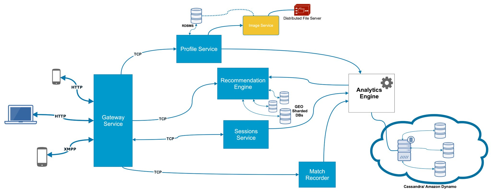

# Case Studies for system design

# Netflix 

Processing Video:
- The video uploaded by the user is processed and stored based on format and resolution. 
- The video format decides the video quality(High, medium, low) - mp4, avi, etc.
- The video resolutions are 320, 480, 720, 1080, etc. 
- The number of tuples formed are Formats * Resolutions. That is the number of videos netflix ends up processing and storing. 
- Processing complete video may take a lot of time. Therefore the video is broken down in pieces and then processed. this will result in (a.mp4, 480p), (a.avi, 720p), (b.mp4, 720p), etc.  
- The breaking down is done based on scenes rather than based on timestamps to improve user experience. 
- Breaking down the video also helps to mitigate the problem of system failure while processing the video. It minimizes the computation loss.

Streaming Video:
- Every video is played based on the device and the internet connection available to the user. 
- Every movie is broken down in pieces based on scenes, and broken down further in smaller parts. 
- If a movie is sparsely watched, when the user asks for a randomly selected part, it only asks for that small part which is asked for.
- If a movie is densely watched, the complete scene is downloaded to improve user experience. 

The videos are stored in AWS S3. 

Caching:
- All the ISPs have a cache box. 
- These ISPs cache the frequently seen videos based on locations so that new requests dont have to fetch the movie from US servers, thus improving the user experience.
- 90% of the traffic is served by these local ISPs, thus making it much faster.
- We can update the cache box with new movies at a time with minimal load, for ex at 4 pm. 

# Tinder

When designing systems, instead of trying to start with data models, then going to services, then to client requests, follow the other way round. Start with the features required by the customers. 

Features: 
- Storing Profiles ( Images, 5 per profile )
- Recommend Matches (No of active users)
- Note matches (around 0.1% of swipes)
- Direct Messaging (chat system)

## Storing Profiles

### Storing Images

2 ways to store: 
- file 
- Blob (Binary large object)

Blob stored in DB. DB provides us following features:
- Mutability - Not required, as not gonna change the image partially
- Transaction Gurantees(ACID) - NR, as no transaction on images
- Indexes (faster Search) - but no search inside image
- Access Control - same thing can be achieved with File system as well

Pros of File System:
- Cheaper
- Faster
- can build CDNs for faster access. 

Images will be stored in Distributed File System. 

 - structure of stored data. 

### Architecture:
 - **Gateway** - only service talking to the client. takes a request, asks profile server if request is authenticated, if yes sends it to correct service and send back the response to the client. 
 - **Profile service** : Basic functionalities like registering a user (will require mail service). After that authenticate requests(using Tokens). Stores basic data like name, desc, etc of the user in a Database.
 - **Image service** : Images are stored on a Distributed File System, handled by a seperate service, as images can be used by other services (except profile) as well (like for ML, data analytics). Following data will be stored in a attached database -  | profile ID | Image ID | File Url |. 

<insert image>

## Chat Service 

Protocol - XMPP (uses websockets) for 2 way communication (chat). With HTTP will require polling, inefficient.

### Architecture
- Open websockets connections (TCP for simplicity) with users
- A seperate session service to store user id and connection Ids.
- A matching service to check if the user1 is allowed (matched or not) to send the message to user2.
- receive message, check if allowed, find connection id of user2, send the message via socket.
- Also store the chat messages in a database based on pairs of users.

for noting matches, just need another matching service which stores in database (user1, user2) (and vice versa). This service can be used while authenticating a messaging request. 

The data about left or right swiped people can be stored on the device itself, as not a critical information. Also, depends a lot on the user, and not necessary to store everything on server. 

Can avoid showing the same profile again to the user using bloom filters.

## Recommending Matches

have to index on age, gender, location. but while querying, can only use 1 of them. 

have a distributed database like cassandra or amazon dynamo. Can perform complicated queries

for relational database, sharding, horizontal partitioning. 

Recommendation service. 
- pulls out all relevant profiles. 
- based on location. then based on age. then on gender. 
- can store user id and locations. also need to update location with time. 

The complete architecture diagram : 

# Whatsapp 

The chats are stored only on the device. deleting application at both the user devices loses the chat forever. 

Features we are gonna cover : 
- sending messages
- last seen
- group messages

### Sending messages

The Gateways maintain websocket connections with the end devices. These connections are expensive to maintain, therefore try to push every other work to other microservices.

When gateways receive any request, they will send it to a parser/unparser micro-service, which forwards it to the relevant microservice for further processing. 

For sending message, we need to maintain a sessions service which stores the data of which user is connected to which gateway endpoint ( | user_id | connected_gateway | ). Using that information the message is forwarded to the relevant gateway which forwards it to receiver using websockets. 

Along with that, a sent confirmation is sent back to the sender.

When received, the receiver sends a message saying delievered which is sent to the gateway, to the session service, and then to the sender. The same applies to read receipts. 

Gateway can take care of a lot of security mechanisms, and therefore we can get rid of http headers, tokens etc once authenticated to have the internal requests perform faster.

## Last seen

Can be a seperate microservice storing | user_id | timestamp |.

To have the information of last seen, we need to keep a record of the last time the user did an activity. Whenever there is any activity by the user, a request is sent to the server which updates the last seen timestamp. 

A threshold needs to be kept for showing online, like only show the user offline if there is no activity for 1 min. 

There are some activities which are done by the application and not the user itself, like sending deliever receipts. We should make sure to not include those while updating last seen. 

## Group Messaging

We can have a different microservice for handling group messages. It can store | group Id | list of users in the group |. 

Whenever a user sends a message to the group, the message is sent to the server, which asks the group microservice the list of user ids present in the group, and then forwards the message to each one of them. 

We can use message queues to handle the load and to retry if the message is not sent to all the group members. A sent receipt should be sent to the server as soon as it is received by the group service. 

Normally the number of participants in a group are limited, because we need to control the fanout. 

We can use consistent hashing to route the request to a particular group service based on group Id. This is done to reduce load on a single machine. 

We can also de-prioritize some services in peak hours like festivals or good morning messages. services like last seen and read and delievered receipts can be bypassed to keep the basic chat working. 

Load balancing, Fault-tolerance (using master and slaves), using message queues, authentication services are standard and applied here as well. 